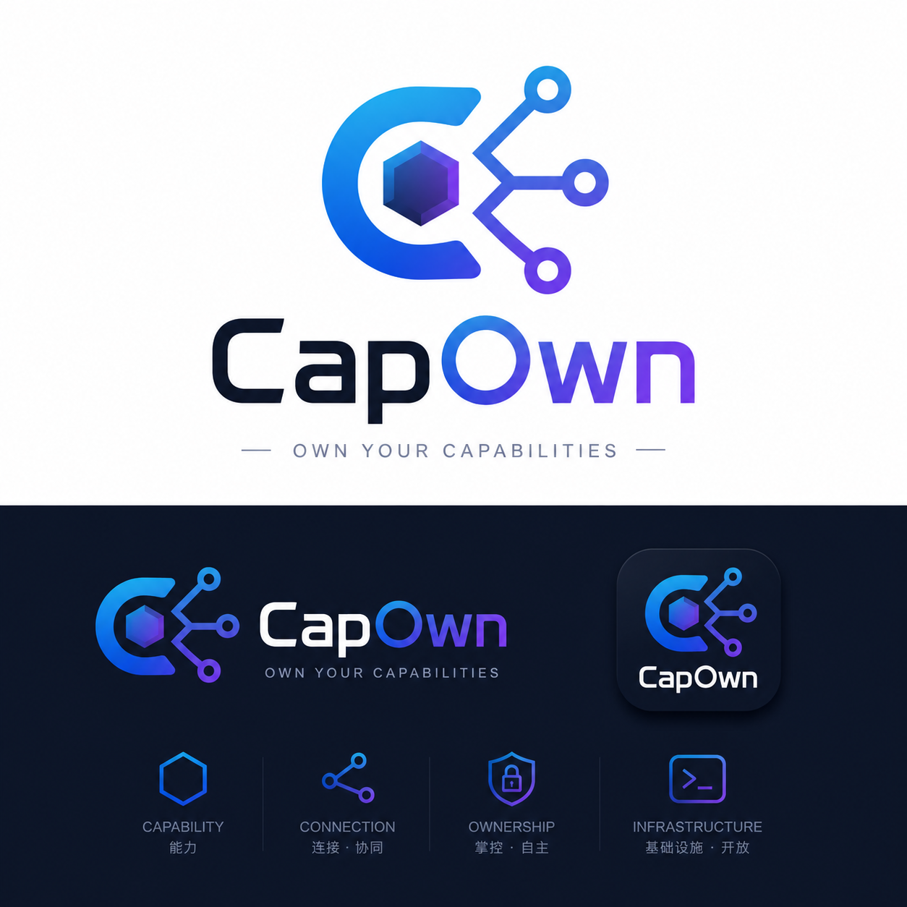

<p align="center">
  
</p>

<p align="center">
  <a href="https://github.com/tappat225/CapOwn/stargazers">
    
  </a>
  <a href="https://github.com/tappat225/CapOwn/blob/master/LICENSE">
    
  </a>
  <a href="https://www.python.org/">
    
  </a>
  <a href="https://github.com/tappat225/CapOwn/issues">
    
  </a>
  <a href="https://github.com/tappat225/CapOwn/pulls">
    
  </a>
</p>

<h1 align="center">CapOwn</h1>

<p align="center">
  <strong>多主机远程操作与 AI Agent 协调系统</strong><br>
  跨网络调度任务 — Worker 仅需出站 HTTPS，无需开放入站端口。
</p>

<p align="center">
  <a href="README.md">English</a>
</p>

---

## ✨ 架构

中央 **Master** 节点通过 HTTPS + SSE 管理并调度任务至多个 **Worker** 节点，实现跨网络执行，Worker 无需开放入站端口。

```
[Client / Agent]
    | (HTTPS POST: 调度任务)
    v
[Master (公网 IP) -- 中央路由]
    ^ (HTTPS POST: 上报结果)
    | (SSE 长连接: 推送任务指令)
    |
    +-- [Worker @ 节点 A]
    +-- [Worker @ 节点 B]
    +-- [Worker @ 节点 C]
    ...
```

### 🧱 设计约束

| 约束 | 说明 |
|---|---|
| 🔌 **全出站连接** | Worker 仅需出站 HTTPS，无需开放入站端口。 |
| 🧭 **中央路由枢纽** | 所有节点间通信均通过 Master 路由。 |
| 🧠 **能力/智能分离** | Worker 负责执行；Agent 负责 LLM 决策。 |
| 🐳 **双部署模式** | 容器 (Docker) 与宿主机 (原生)。容器模式将宿主机目录挂载为工作区；宿主机模式直接执行命令。 |

### 🧩 组件

| 组件 | 职责 |
|---|---|
| **Master** | 节点注册表、SSE 代理、任务路由、认证网关 |
| **Worker** | 轻量守护进程 — 连接 Master、执行任务、上报结果 |
| **Client** | CLI 工具 / SDK，向 Master 调度任务 |

> 📖 架构详情及目录结构请参阅 [docs/architecture.md](docs/architecture.md)（英文）。

## 🚀 快速部署（推荐）

使用交互式部署脚本，引导式配置 — 无需参数：

```bash
cd CapOwn/
python3 deploy.py
```

部署脚本完全菜单驱动，引导完成 Master、Worker 或两者的配置。

> 📖 完整部署指南（包括 Nginx 配置、构建参数、镜像选择及故障排查）见 [docs/deploy.md](docs/deploy.md)。

## ⚡ 快速使用

```bash
# 列出已注册的 Worker
python client/capown_client.py nodes

# 在指定 Worker 上执行 Shell 命令
python client/capown_client.py run worker-1 "uname -a"
```

> 📖 完整使用指南（包括配置说明、所有 CLI 命令、直接 API 调用、错误码及能力词汇表）见 [docs/user_guide.md](docs/user_guide.md)。

## 🤝 贡献

欢迎贡献代码！在发起 Pull Request 之前，请阅读 [CONTRIBUTING.md](CONTRIBUTING.md) 和 [CLA.md](CLA.md)。Pull Request 仅接受同意 CapOwn CLA 的贡献者提交。

## 📄 License

CapOwn 使用 **open-core** 授权模式：

| 范围 | 许可证 |
|---|---|
| `client/`、`worker/`、`shared/`、`docs/`、部署工具、根目录配置 |  |
| `master/` (Community Master) |  |
| 商业 Master、托管服务、计费、租户管理、企业策略 | 专有商业许可 |

> 📖 详见 [LICENSE](LICENSE)。
