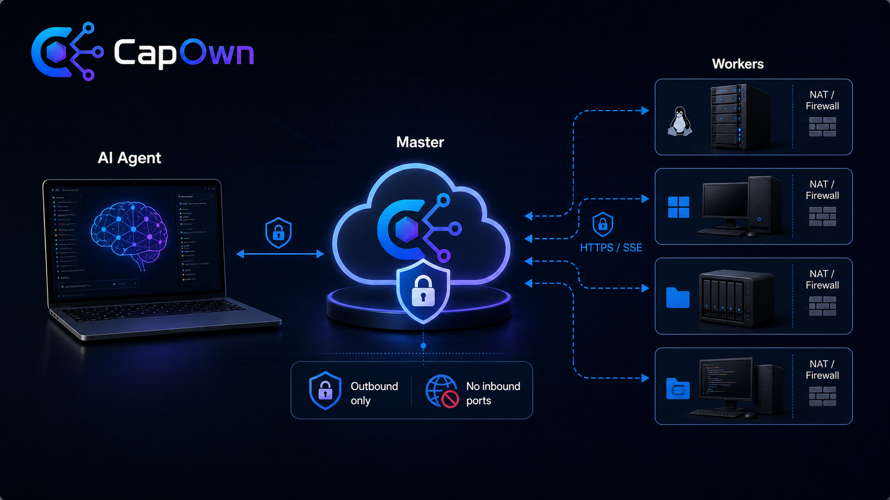

# CapOwn

<p align="center">
  
</p>

----

<p align="center">
[ <a href="README.md">En</a> | <b>中</b> ]
<b>多主机远程操作与 AI Agent 协调系统。</b>
</p>

[](LICENSE)
[](https://www.python.org/)
[](https://github.com/tappat225/CapOwn/issues)
[](https://github.com/tappat225/CapOwn/pulls)

CapOwn 让本地 AI Agent 可以使用其他机器作为远程执行双手。Worker
主动向 Master 建立 HTTPS/SSE 出站连接，因此 NAT 后面的机器不需要公网
IP，也不需要开放入站端口。

**一个 Agent。多台设备。无需入站端口。最小信任中继。**

[用户指南](docs/user_guide.md) | [部署指南](docs/deploy.md) | [贡献说明](CONTRIBUTING.md)

## 为什么需要 CapOwn

现代 AI 编程 Agent 经常知道该做什么，但真正能执行任务的机器在另一处：
NAT 后面的 Linux 测试机、带 GPU 的工作站、NAS，或装有本地工具的桌面。

CapOwn 的首要目标很窄：

- 在另一台机器上安装轻量 Worker；
- 让本地 Agent 发现这台机器；
- 通过 Master 中继执行文件、Shell 和系统信息任务；
- 返回结构化结果和机器可读错误。

## 功能

- **Worker 全出站连接**：Worker 通过 HTTPS + SSE 连接 Master。
- **Agent 友好动作**：Shell、文件读写/列目录、系统信息。
- **紧凑能力词表**：`shell.run`、`file.read`、`file.write`、
  `file.list`、`system.info`。
- **结构化错误**：例如 `node_offline`、`workspace_violation`、`timeout`、
  `output_too_large`。
- **Workspace 控制**：文件和 Shell 操作会按 Worker 配置的 workspace
  解析路径。
- **同步与异步任务**：短任务同步返回，长任务可 dispatch 后轮询元数据。
- **最小任务持久化**：Master 只保存路由和状态元数据，不默认保存原始命令、
  文件内容或完整 stdout/stderr。
- **容器或宿主机 Worker 模式**：可选择 Docker 隔离，或在可信机器上原生执行。

## 快速开始

使用交互式部署脚本：

```bash
git clone https://github.com/tappat225/CapOwn.git
cd CapOwn
python3 deploy.py
```

然后根据 `client/config.ini.example` 配置客户端。

CapOwn 客户端专为 **AI Agent** 设计。配置完成后，让你的 AI Agent 读取
[client/SKILL.md](client/SKILL.md) —— Agent 通过 `capown` 命令发现 Worker、
执行 Shell 命令、读写文件。

你也可以手动快速验证连接是否正常：

```bash
python client/capown_client.py nodes
python client/capown_client.py info worker-1
python client/capown_client.py run worker-1 "echo hello"
```

关于长任务（`capown dispatch` + `capown task`）、直接 API 调用、
错误码和能力词表的详细说明，见
[docs/user_guide.md](docs/user_guide.md) 和
[client/SKILL.md](client/SKILL.md)。

## 架构

```text
AI Agent / CLI
    |
    | HTTPS task dispatch
    v
CapOwn Master
    |
    | SSE task events over outbound Worker connection
    v
CapOwn Worker
    |
    | local execution
    v
Target device workspace
```

### 组件

| 组件 | 目录 | 职责 |
|---|---|---|
| Shared | `shared/` | 协议模型、认证工具、配置 schema |
| Master | `master/` | Starlette 控制平面、注册表、路由器、SSE broker |
| Worker | `worker/` | 轻量守护进程和执行器 |
| Client | `client/` | CLI 与 Agent 使用指南 |
| Docs | `docs/` | 部署和用户文档 |

## CLI

| 命令 | 说明 |
|---|---|
| `capown nodes` | 列出已注册 Worker |
| `capown info <node>` | 查看 Worker 系统信息 |
| `capown ls <node> [path]` | 列出 Worker workspace 内文件 |
| `capown read <node> <path>` | 读取文件 |
| `capown write <node> <path> <content>` | 写入文件 |
| `capown run <node> <command>` | 执行 Shell 命令 |
| `capown dispatch <node> <command>` | 异步调度 Shell 任务 |
| `capown task <task_id>` | 轮询任务元数据 |

旧命令名仍保留，用于向后兼容。

## 文档

- [用户指南](docs/user_guide.md)：客户端配置、CLI 命令、直接 API 调用、
  错误码和数据保留说明。
- [部署指南](docs/deploy.md)：Docker、宿主机 Worker、Nginx/SSE 代理配置和
  故障排查。
- [CapOwn Agent Skill](client/SKILL.md)：AI Agent 使用 CapOwn 的建议。

## 安全模型

CapOwn 是给你控制的机器使用的远程执行工具。

- Node API 和 Client API 使用不同 bearer token。
- Worker 文件系统操作会限制在配置的 workspace 内。
- 容器模式依赖 Docker namespace 边界。
- 宿主机模式会在主机上执行命令，只应在可信机器上使用。
- 开源 Master 默认只持久化任务元数据。

数据保留细节见 [docs/user_guide.md](docs/user_guide.md#data-retention)。

## 贡献

欢迎贡献代码。发起 Pull Request 前，请阅读 [CONTRIBUTING.md](CONTRIBUTING.md)
和 [CLA.md](CLA.md)。Pull Request 仅接受同意 CapOwn CLA 的贡献者提交。

## License

CapOwn 使用 open-core 授权模式。

| 范围 | 许可证 |
|---|---|
| `client/`、`worker/`、`shared/`、`docs/`、tests、部署工具、根目录项目文件 | Apache-2.0 |
| `master/` | AGPL-3.0-only |
| 商业 Master、托管服务、计费、租户管理、企业功能 | Proprietary |

详见 [LICENSE](LICENSE) 和 [LICENSES](LICENSES/) 目录。
